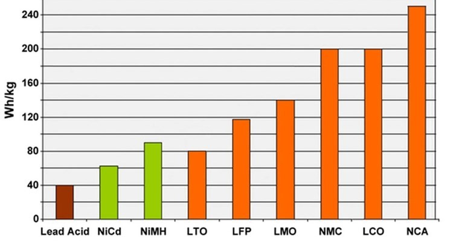

# Cells for EVs
Blow are some pros/cons of each cell chemistry, through my lens of what I plan to achieve with my various EV builds.

# Terms
 - Energy Density: How much total energy a cell stores, IE how much range we'll get.
 - Power Density: How much current the cell can deliver at once, IE how hard we can punch it.
 - Thermal stability: How well the cell performs at low temps, and what it's max upper temps are like.
 - Safety: How safe the cell is, especially in the event something goes wrong.

# Cell Comparisons

## Traditional Lithium (NCA, NMC, etc)
I'm grouping all these together as they sort of fall into the same category for my uses. This is probably the most common chemistry, used in phones, laptops, electric scooters. [Tesla has been using NCA](https://insideevs.com/news/575956/tesla-battery-chemistries-explained/) for a while in their cars, and [will be using NMC](https://insideevs.com/news/598656/tesla-4680-battery-cell-specs/) for their upcoming 4680 cells. These chemistries are the most energy dense out there, and can deliver reasonable power output too. They also require very strigent battery and thermal management. Improper managment can lead to the classic lithium battery failure we've all seen before.

Pros:
 - Incredibly energy dense
 - Decent power density (~3C) 
 - Readily available EV/Hybrid packs from salvage yards

Cons:
 - Requires very accurate battery management.
   - If you do these things wrong, they'll start on fire:
     - Overcharge (over voltage)
     - Undercharge (under voltage)
     - Charge too fast
     - Discharge too fast
     - Get too hot
   - When they get too cold, you cannot use them without risk of damanging them
     - Which can eventually lead to a fire

## Lithium Iron Phosphate (LiFePo4)
LiFePo4 is starting to become more common, with [Tesla using them](https://electrek.co/2022/04/22/tesla-using-cobalt-free-lfp-batteries-in-half-new-cars-produced/) in their standard range line of cars. I've personally seen them used more with solar setups, but I'm also seeing a good amount of people using them in their DIY EVs. They're much more forgiving in the safety and thermal departments than NCAs and the like, though not as much as LTOs.

Pros:
 - Stable, rarely catch fire when they're damanged/overcharged
 - Readily available cells from Alibaba and the like
 - Higher cycle life than NCA
 - Higher (dis)charge current than NCA (unable to find true numbers on this?)
 - No rare-earth materials (no cobalt), so should be cheaper

Cons:
 - Half as energy dense than NCA
 - Lower voltage per cell than NCA

## Lithium Titanite (LTO)
LTOs are still pretty obscure, but I think they do have a place in EVs, specifically in performance EVs. They boast the highest cycle lifes, excellent thermal tolerance, the best safety, and can deliver more power than any other chemistry. All that comes with a downside of not being very energy dense at all, which is a pretty big downside.

Pros:
 - Very stable, don't catch fire when damaged/overcharged
 - Tolerates a wide range of temperatures
 - Highest cycle life we have right now

Cons:
 - Holds very little energy (see graph)
 - Very low cell voltage, so you need more of them.
 - Expensive due to low usage

# Links
 - [Video of torture tests on Li-Pol, LFP, and LTOs](https://www.youtube.com/watch?v=Qzt9RZ0FQyM)
 - [Summarize the Characteristics and Parameters of Six Common Lithium Batteries](https://www.linkedin.com/pulse/summarize-characteristics-parameters-six-common-lithium-cynthia-pan)
   - Good summary of common lithium chemistries
 - [Wikipedia Comparison of commercial battery types](https://en.wikipedia.org/wiki/Comparison_of_commercial_battery_types)
   - Provides more info on different battery chemistries, outside of Lithium.

# Footnotes
 - For all lithium chemistries, you can trade lifespan for (dis)charge current if you so choose
   - As long as you don't go past what's safe for your chemistry
   - Your baseline current rating is determined by the chemistry you choose
   - More info on C ratings [can be found here](https://energsoft.com/blog/f/c-rate-of-batteries-and-fast-charging).