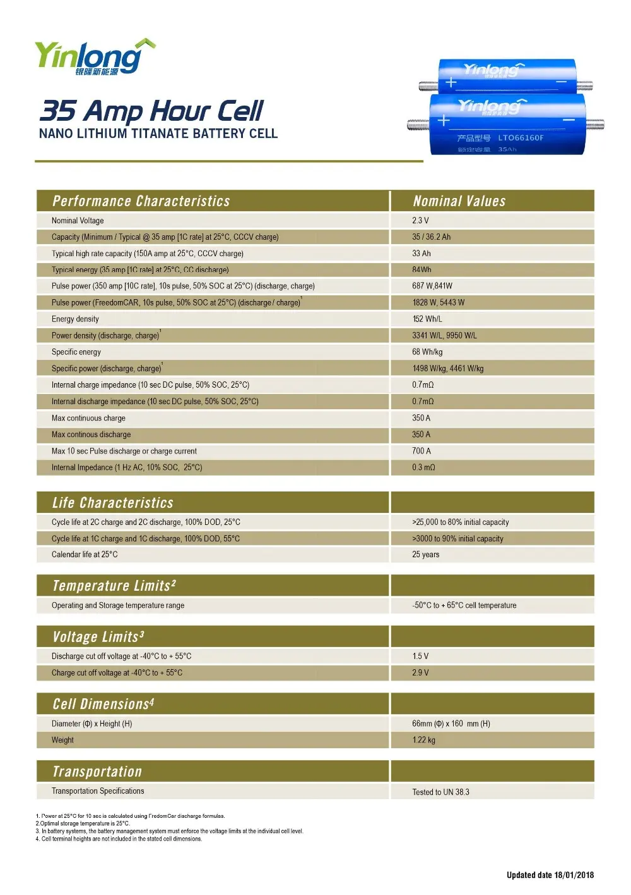
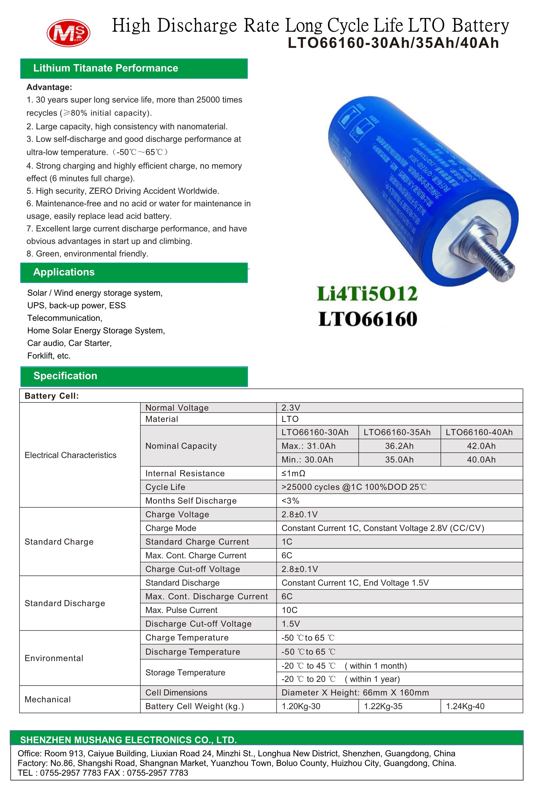

{width=450}

# Yinlong LTO Cell

## Summary
These cells seem to come in varying capacities, and can still deliver a ton of current. Not as high as the Lishen cells, though.

## Datasheet
This is a datasheet I found on a random Alibaba listing.

  
This is a datasheet I found on a random Alibaba listing.

   {max-width=600}

  
Here's another one too

  
   {max-width=600}

## Links

### Videos
 - [Torture tests (drilling, cutting, etc)](https://www.youtube.com/watch?v=eAUYbSDEy6I)
 - [Load test (Probably rebranded Yinlong)](https://www.youtube.com/watch?v=X773lrAI3r0)
 - [Yinlong next to Lishen](https://www.youtube.com/watch?v=p5-nHNJn8WQ)
 - [Someone pulling 1700 amps](https://www.youtube.com/watch?v=mLunf10SegA)