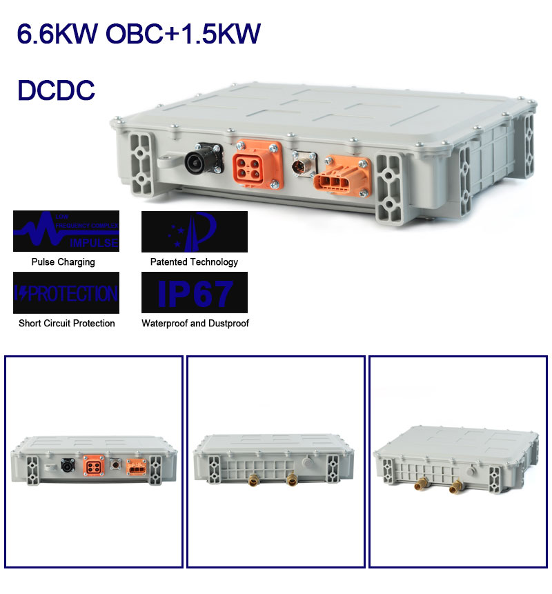

{max-width=450}

# Ovartech 6.6kw Charger w/ DC/DC Converter
A quick and easy charger. Typically sold by US resellers at a significant markup. Found on Aliexpress for ~$1000 less, including shipping. Note that the connector part numbers are located within the datasheet linked below.

Model Number: `CAD662DF400-14152`

[Datasheet](./Datasheet.pdf)

## Sales Info
This product is a combination high-frequency 6.6 kW battery charger and 1.5 kW DC/DC converter in one package. Integrating the high-frequency battery charger and DC/DC converter saves space, weight and cabling; thereby minimizing the cost of inventory, installation and service.

The Ovartech on-board charger series is designed for electric vehicle battery charging with a demand for efficiency, robustness and safety. The electrical input voltage for it ranges from AC 85-265 V, making it an ideal selection for worldwide usage. Its high-efficiency performance makes charging more economical. It provides an intelligent charging mode that adjusts the voltage in CC/CV/cut-off automatically. It also features protection against short-circuits, over-voltage, under-voltage, over-current and over-temperature. The CAN-bus interface delivers messages with charging flow, interlock connection, and any disconnection or error message to VCU (Vehicle Control Unit) via BMS (Battery Management System).

The Ovartech charger series is in compliance with SAE J1772 and IEC 61851 to meet international standards and with IP 67 for the critical operating environments. 