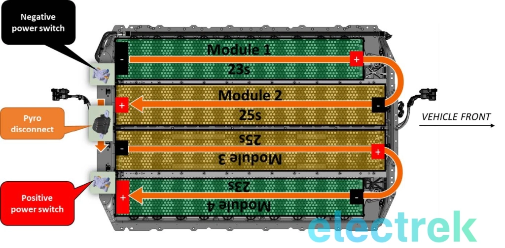
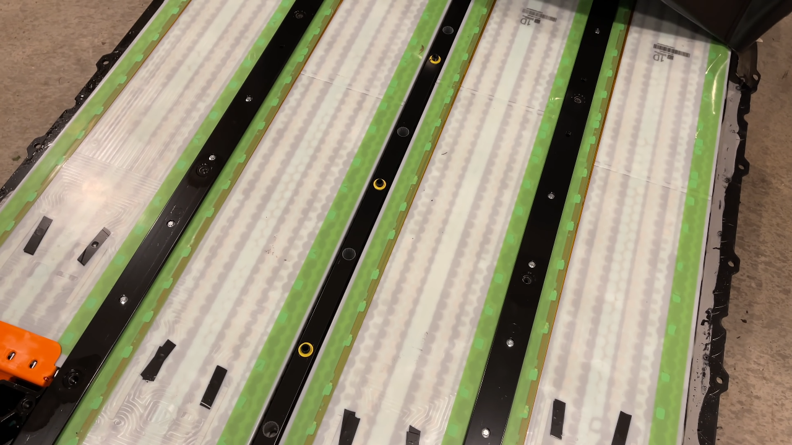

# Model 3 Battery Module Notes
Most of this info was obtained from [here](https://electrek.co/2017/08/24/tesla-model-3-exclusive-battery-pack-architecture/).

## Battery Info
2170 cells, arranged in a 23s46p config for the shorter modules, and 25s46p for the longer ones.
Each individual cell is 3.7v 4800mAh (maybe?). 

[{width=400px}](./model3battery.webp)

### Difference between long range and standard range modules
It looks like the standard range modules simply substitue some cells with more of that glue goop. More info [here](https://youtu.be/8Wamu0hyngU?t=287).

[{width=400px}](./missingcells.png)
