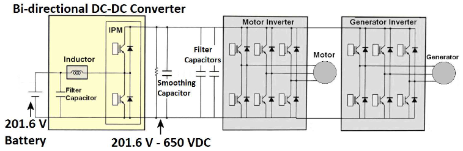

# Toyota Prius Inverter (Gen 3)
Just some of my notes on the Toyota Prius Inverter. Most are assuming you're using Damien's [Gen 3 control board](https://openinverter.org/wiki/Toyota_Prius_Gen3_Board).

The image below shows a diagram of the power electronics. Note that what this diagram calls the "DC-DC converter" we typically call the buck/boost converter, and it doesn't actually show the 12v DC-DC converter we typically use. The buck/boost converter is capable of 27kw, as stated in the docs below.

[Diagram and full evaluation of the inverter](./PriusInverterEvaluation.pdf), originally found at [this link](https://info.ornl.gov/sites/publications/files/pub26762.pdf).