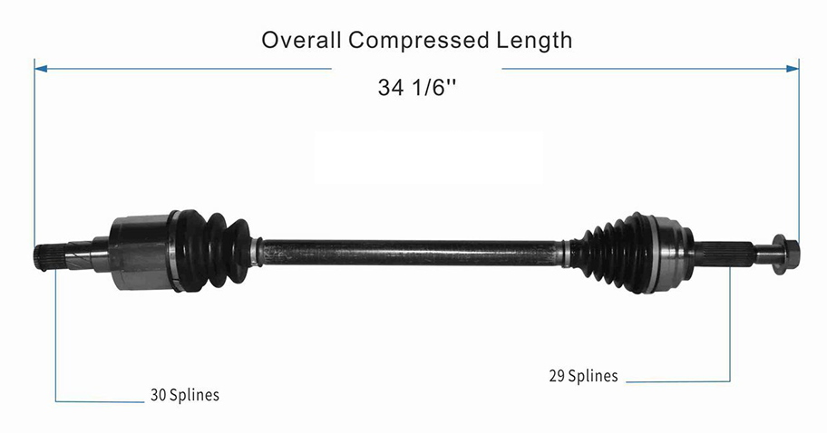

# Tesla Large Rear Drive Unit (LDU)
While picking up the LDU, the previous owner mentioned that it may be necessary to swap the A and B pins on the encoder in order for the DU to begin rotating.

## Connectors
Main 23 pin connector is an `TE Ampseal 770680-1`. Just so happens to be the came connector as the MS3 Pro Center plug, so you can get a [flying-lead harness](https://www.diyautotune.com/product/ms3pro-ultimate-center-harness/) from them.

The motor encoder connector is a `TE 444046-1`. 

## CV Shafts
{ max-width=300 }

## Precharge
Going to use a 100W 50ohm resistor, as described [here](https://openinverter.org/forum/viewtopic.php?p=33444&sid=b44fa5684b27a7360ebb450e0616a000#p33444). Will use a standard 12v automotive relay for precharge, as described [here](https://www.diyelectriccar.com/threads/precharge-relays.68206/post-279179) and [here](https://www.diyelectriccar.com/threads/precharge-relays.68206/post-279414). 

## Contactors
Going with EVC500 contactors. 