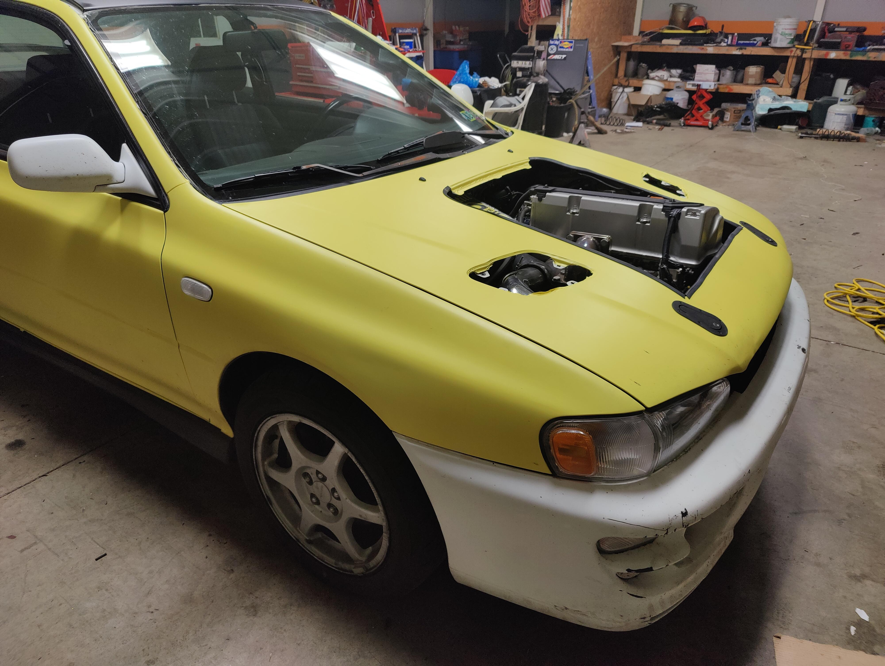

{ width=450 }

# Honda Swapped Subaru Impreza
My 2000 Subaru Impeza RS Coupe that I swapped with a Honda K24A2.

 - [YouTube video playlist](https://www.youtube.com/watch?v=Z-DdCNjM8aU&list=PLFQKxsMzgSbg17kyCzaNmexq7qo9Ydp6C)

## Introduction
After being out of the car scene for a while, I opted to jump back in with this swap. It was also the first thing I posted on YouTube about. Ahhh, memories... I had read about the K series before, and there's lot of toys to play with like VTEC and VTC. So I had to have one.

 It uses an off-the-shelf adapter plate to adapt the Honda engine to the Subaru trans, thus maintaining the classic Subaru AWD. See the parts list below for all that.

After driving the car around for a year I ended up taking it to the dyno and [blowing it up](https://www.youtube.com/watch?v=2WlubEBycJc), making 466hp at the same time. Very cool.

## Parts List
Here's most of the stuff I used on the Hondaru build.

### Engine
 - Stock K24A2
 - Stock Subaru 5 Speed Transmission
 - Haltech Elite 2500 ECU
 - Subaru Gears Honda K Series Adapter Plate [Link](https://www.subarugears.com/product/honda-k-series/)
 - Clutch Masters FX400 Clutch [Link](https://clutchmasters.com/i-30505729-subaru-xv-crosstrek-2013-2015-2-0l-15013-hdc6.html)
 -  FIC 1200CC Fuel Injectors [Link](https://fuelinjectorclinic.com/Honda/K(01-11)-D17-S2K(06-09)/IS116-1200H) | [Backup](./parts/Injectors.pdf)
    - These ended up being too small for even 12psi of boost, so I later upgraded to 2150s from FIC as well. They were very understanding and ended up giving me good deal on them.
 - Fuel Rail [Link](https://www.ebay.com/itm/323608063092) | [Backup](./parts/FuelRail.pdf)
 - Fuel Pressure Regulator [Link](https://www.ebay.com/itm/254749363596) | [Backup](./parts/Fpr.pdf)
   - This ended up failing on me. Would drop fuel pressure under boost, which was fun. Ended up swapping it with a genuine Aeromotive unit. The fittings it came with are still good though.
 - Exhaust Manifold [Link](https://www.ebay.com/itm/350792031715) | [Backup](./parts/ExhaustManifold.pdf)
 - Upper Coolant Housing [Link](https://www.ebay.com/itm/114238768136) | [Backup](./parts/UpperCoolant.pdf)
 - Swivel Thermostat Housing [Link](https://www.ebay.com/itm/113520236147) | [Backup](./parts/ThermostatHousing.pdf)
 
 ### Turbo
 - eBay GT3582 Turbocharger [Link](https://www.ebay.com/itm/313405020842) | [Backup](./parts/Turbo.pdf)
 - Blow Off Valve [Link](https://www.ebay.com/itm/323976370478)  | [Backup](./parts/Bov.pdf)
 - Air Water Intercooler [Link](https://www.ebay.com/itm/183903814619) | [Backup](./parts/AWIC.pdf)
 - Air Water Intercooler Exchanger [Link](https://www.ebay.com/itm/284284503552) | [Backup](./parts/AWICExchanger.pdf)
 - Wastegate [Link](https://www.ebay.com/itm/151739405815) | [Backup](./parts/Wastegate.pdf)
 - Turbo Oil Feed [Link](https://www.ebay.com/itm/264004884925) | [Backup](./parts/OilFeed.pdf)
   - Somehow the turbo kit didn't come with the right one. This is it.
 
 ### Body
 - ISC Suspension N1 Street Sport Coilovers [Link](https://www.rallysportdirect.com/part/coilovers/s001-s-isc-suspension-n1-street-sport-coilovers) | [Backup](./parts/Coilovers.pdf)
 - Firehawk Indy 500 Tires

 ## Adapter Plate Kit
The adapter plate kit I used had some issues that have since been fixed. The fella who makes the kits reached out to me and asked for more details and I believe has since updated his designs to fix these issues.

 I mentioned them in [this video](https://www.youtube.com/watch?v=WA76vNyVP2k) but, to summarize, the crank bolt circle was too tight to fit the socket over the bolt head.

 
[{width=400px}](./flywheel_marked.png)