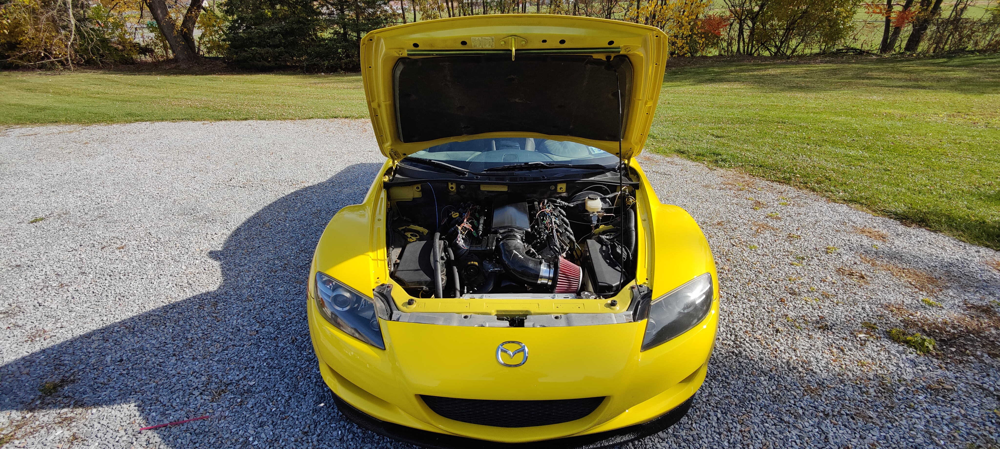
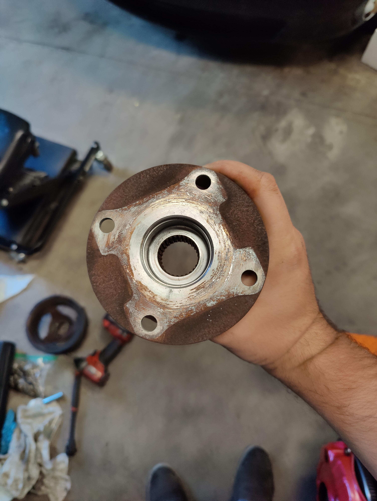
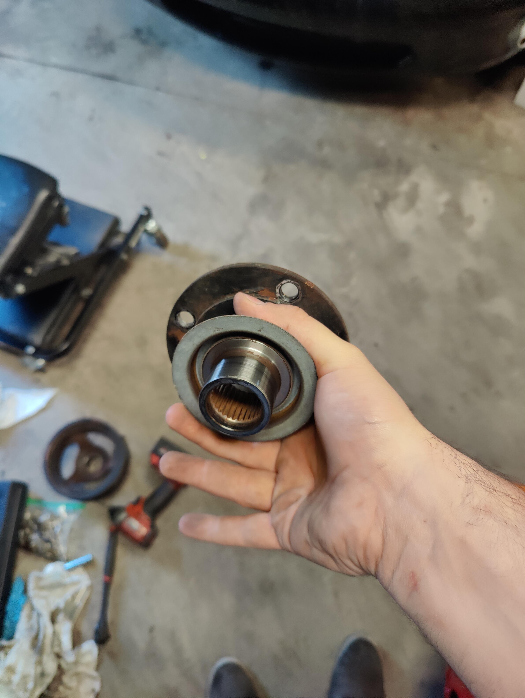
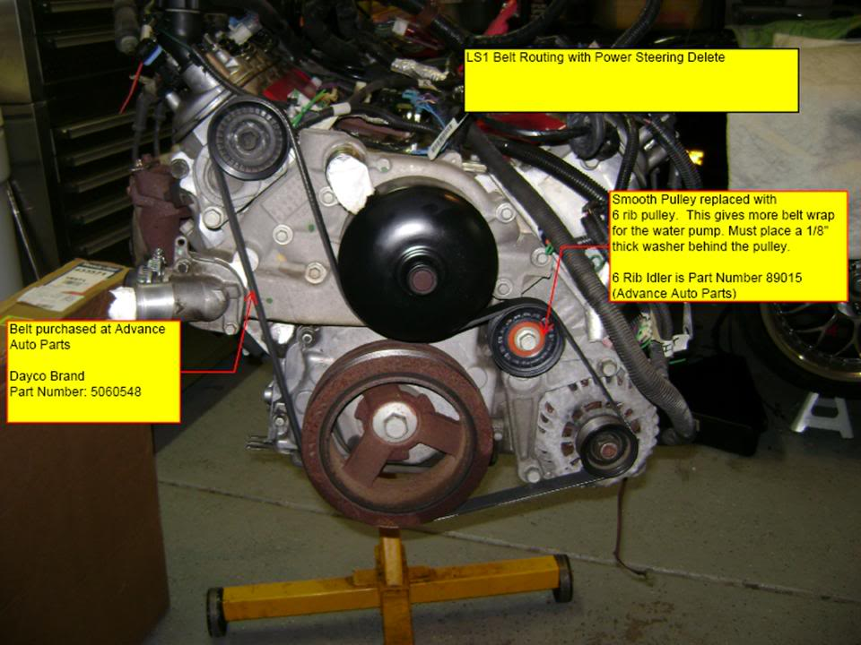

{ max-width=700 }

# LS Swapped RX8
My LS swapped 2004 Mazda RX8. A pretty ordinary RX8 swap.

- [YouTube Playlist](https://www.youtube.com/watch?v=roqDr_wmshs&list=PLFQKxsMzgSbjZnwXcpXVVN8Lz_NSmB76C)

## Introduction
I had hankering to play with an LS, so I decided to look into swapping one into something. I started looking for the cheapest cars I could find that were RWD and that I thought looked cool. Enter the RX8. This was a much easier swap than my [Honda K Swapped RX8](/Hondaru/Index.md).

## Parts List
Here's a good parts list on what I bought for this swap.

### Engine
 - Stock Salvage LQ4
 - T56 Magnum F Transmission [Link](https://www.grannasracing.com/collections/transmissions/prod…-f-transmission-6-speed-tuet16363-wide-ratio-2-97-first-gear) | [Backup](./parts/Trans.pdf)
 - Haltech Elite 2500 ECU
 - CXRacing Mount Kit [Link](https://www.cxracing.com/engine-swap-kit-mazda-rx-8-ls1) | [Backup](./parts/Mounts.pdf)
 - Sloppy Stage 2 Camshift Kit [Link](https://www.ebay.com/itm/324504557278) | [Backup](./parts/Cam.pdf)
 - Trailblazer SS FlexFuel Injectors
 - Low Profile Intake Manifold/Rails/Throttle Body [Link](https://www.ebay.com/itm/265796398463) | [Backup](./parts/IntakeManifold.pdf)
 - RAM HDX Clutch Kits 88931HDX [Link](https://www.summitracing.com/parts/RAM-88931HDX) | [Backup](./parts/Clutch.pdf)
 - McLeod Nodular Iron Flywheels 450530 [Link](https://www.summitracing.com/parts/MCL-450530) | [Backup](./parts/Flywheel.pdf)
   - I'd invest more in a better clutch/flywheel setup next time. This one seems to drag a bit, despite me checking the clearences as described in [this document](https://www.tickperformance.com/tick-performance-slave-cylinder-shim-kit-3-pack/).
 - Clutch master kit [Link](https://v8roadsters.com/product/rx8-lfx-ls-clutch-kit/)
 - Universal Radiator (Needed different inlet/outlets welded on) [Link](https://www.ebay.com/itm/274869186448) | [Backup](./parts/Radiator.pdf)
 - Swivel Thermostat Housing [Link](https://www.ebay.com/itm/174679658880) | [Backup](./parts/Thermostat.pdf)
 - Low profile oil pan [Link](https://www.amazon.com/gp/product/B09VX9QHNJ) | [Backup](./parts/OilPan.pdf)
   - Takes these oil filters:
     - PF48
     - PL12222

 ### Body
 - Steering Rack Extension [Link](https://www.cxracing.com/SS-PIP-RX8-STEERING) | [Backup](./parts/SteeringExtension.pdf)
 - TEIN Street Basis Z Coilovers

## ABS Delete
In order to fit the LS, I had to delete the ABS pump. It was sitting right where the head was. I think you can clear it on cars that didn't come with DSC, but mine did and I can't be arsed to mess with it.

### Random brake notes
Tese are just some notes that I took while looking up brake line parts in the past. Do with them what you will. 

When I deleted the ABS unit, I used 3/16" line to everything. I used (splitters)[https://www.amazon.com/gp/product/B01KNGVKEA] to come out of the master cylinder to go to each wheel. Yes, each of the two splitters are fed by 3/16" line. Haven't had any issues with braking power or responsiveness. 

[Brake line size reference](https://ricksfreeautorepairadvice.com/brake-line-fitting/)

Because of the weird sizes, I opted to get a [3/16" brake fitting kit](https://www.amazon.com/gp/product/B07BMZDKXD). It ended up having everything I needed.

Some notes taken from [here](https://www.rx8club.com/series-i-tech-garage-22/brake-master-cylinder-versions-272660/):

There are 4 versions of the master cylinder for the 04-05 cars. The early cars used a Tokico MC with the ports facing down. I believe that a build date around 06/05 is where the switch to a different style MC was made with the ports facing to the side.
Both the early and revised MC have two variants, one for cars equipped with the Bosch DSC ABS and one for cars with the Sumitomo ABS. The Bosch ABS unit MC uses M12 fittings with 6mm lines (if I recall correctly they are bubble flare,) and the Sumitomo ABS MC uses M10 inverted flare fittings and 4.75mm lines.

Not sure why the switch from the original MC was made as the only difference is the location of the fittings. Bore size was the same across all variants and years (7/8"/22.23mm). My assumption is that it was either cost related or the original design was unreliable.
You can use either the early or late design that matches the ABS unit in your car, but changing between designs will require you to buy or make the hard lines to match the MC. The early design is harder to come by as I believe it is only available new from Mazda, most likely you will need to send an early MC off to be rebuilt if needed.

https://www.rx8club.com/series-i-tech-garage-22/brake-master-cylinder-versions-272660/

## Drive Shaft
I opted to stick with the stock RX8 rear diff. I did consider to do the Ford 8.8 upgrade, but given the cost of everything I figured I'd wait until I shredded the stock rear diff to do that. I measured from the output shaft of the trans to the flange on the diff.

I then removed the flange from the diff (pictured below) and took that and the original carbon fiber drive shaft, and the measurement to a local diesel mechanics shop, where a buddy of mine works. They regularly fab custom drive shafts there for big trucks, but they can make stuff for cars too.

Using the flange, old drive shaft, the measurement, and a slip yoke I bought alongside the T56 Magnum-F transmission, they were able to fab up a new drive shaft.

{max-width=400}
{max-width=400}

## Headunit Notes
The headunit controls the HVAC so you need some special stuff to make it work right. I ultimately decided to go with an [Axxes control box and setup](https://axxessinterfaces.com/product/95-7510) that controls the HVAC, and an [Android head unit](https://www.amazon.com/gp/product/B09FK3KDWN). Got my Axxes stuff used on eBay for much cheaper.

### RX8 Display
The little display in the center of the dash is pretty cool. Before deciding to get an aftermarket headunit setup that could handle it, I was looking into controlling it myself. Ended up finding this [Github repo](https://github.com/TonyChatfield/S1-RX8-AC-Display-controller).

## Engine Notes
### Accessories
I'm running an LQ4, which is a normal ol truck engine and using the factory electric power steering rack. I need to both relocate the alternator down lower and delete the LS truck power steering rack. To achieve this, did two different things.

First, I installed an [ICT Billet alternator relocation bracket](https://www.amazon.com/gp/product/B00NY51SBI). This involves drilling and tapping a hole in the cast aluminum block which was easier than I thought it'd be. 

Followed the powersteering delete detailed in [this forum post](https://www.s10forum.com/threads/power-steering-delete-on-ls1-engine.851875/).

With both of these my accessories were easy.

[{ width=400 }](./LS1PSDeleteBeltRouting.jpg)

## Other notes
 - There's a pinch weld that goes around the frame rails/firewall/entire engine bay. This is so close to the headers that I can't get the rear-most bolts in on them. Next time I'll hammer that down flat so I have a bit more room.
 - I'm running a standalone Haltech ECU. I didn't have a stock tune for this engine, so I grabbed a factory ECU tune from the [Sloppy Mechanics Tune Cabinet](https://sites.google.com/site/sloppywiki/tunecabinet).
   - It was in the EFILive format, so I downloaded that and just manually copied and pasted the stuff from there into the Haltech software to make the base tune.