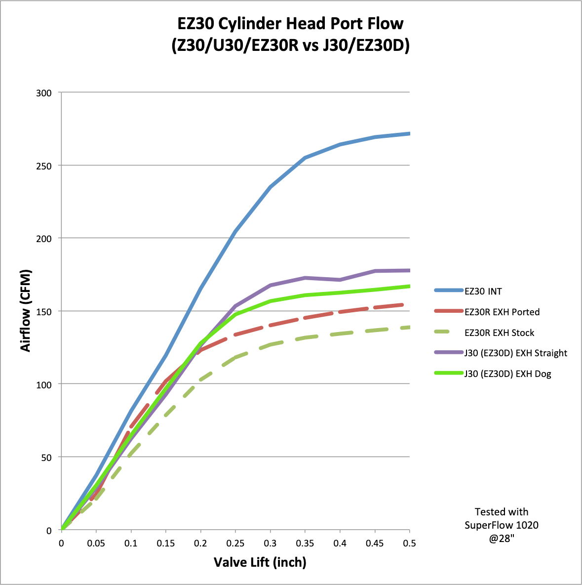
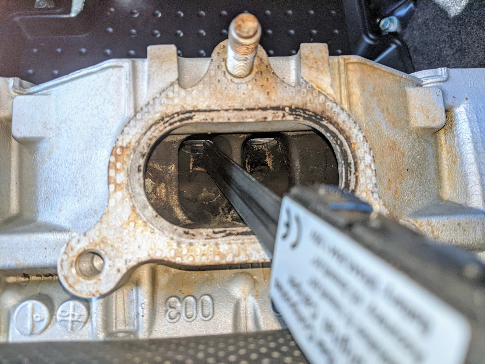
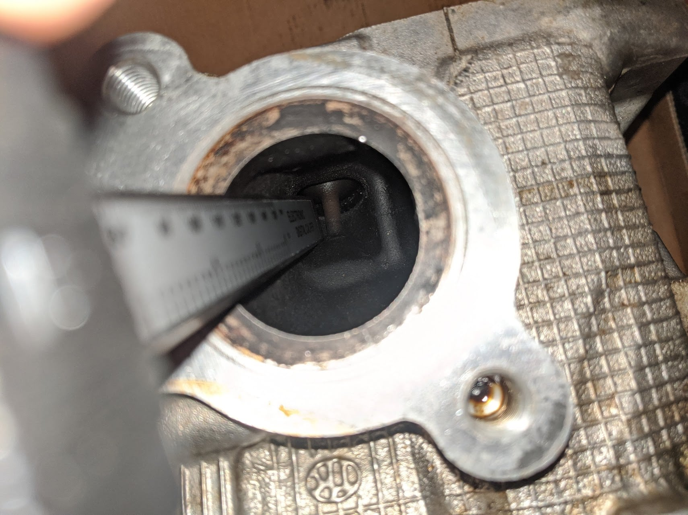
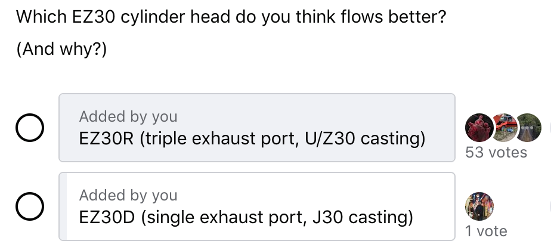
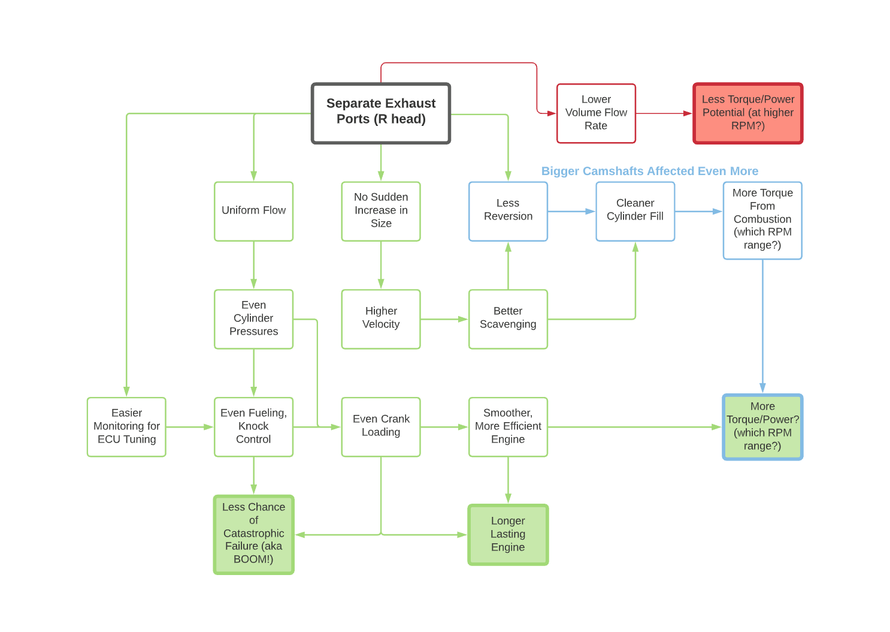
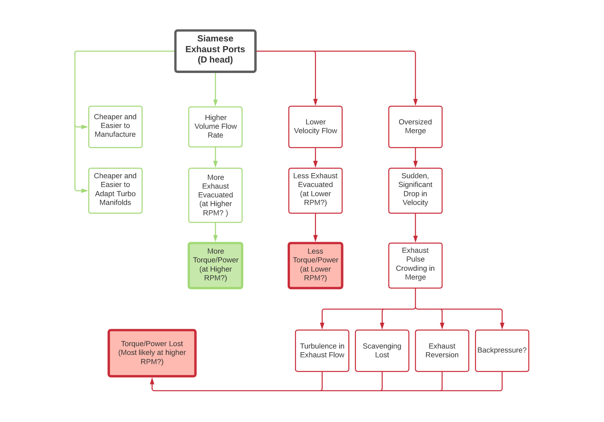
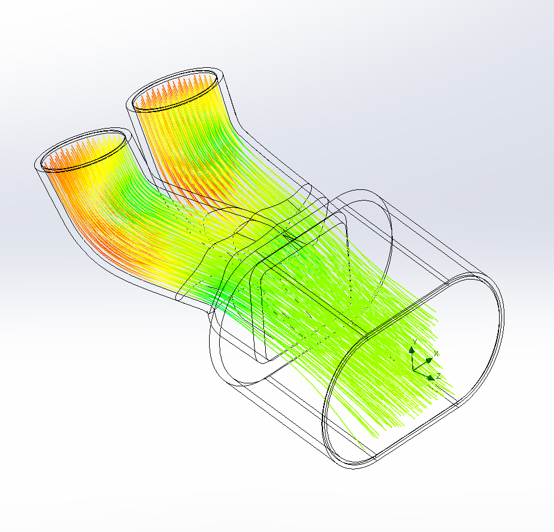
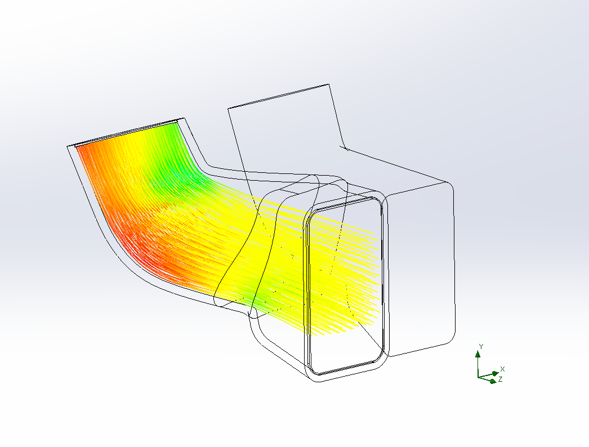

# H6 Head Flow EZ30R vs EZ30D
A YouTube commenter named _al73r_ presented the following information in a thread on this [YouTube community post](https://www.youtube.com/channel/UCMPcTZeqEgjGwmXj1-84GgA/community?lb=UgkxInqgPNOAUGcLEoao1MaKs0RrstcotRB6) I made.

Two Facebook posts by [Borsch Power](https://www.facebook.com/BorschPower), [here](https://www.facebook.com/BorschPower/posts/114617380824171) and [here](https://www.facebook.com/BorschPower/posts/pfbid02UTPVrH1GnEEmszk82z7mkoDy3Q8TixLa1VcrxWE9qbEc1w8C9F3KYDrTwmYnUHNUl), copied below as well.

## Part 1
EZ30D Cylinder Head Flow [Part 1/2] - “Surprise!"
Well... this was unexpected. 
Quick summary - after recently flow testing the EZ30R cylinder heads (U30/Z30 castings with triple port exhaust), curiosity got the better of me and I HAD to know how the EZ30D (J30 cast, single or "siamese" exhaust port) compared. 
The R-heads flowed ~270cfm on the standard intake, ~135cfm standard exhaust and ~150cfm ported exhaust. 
At the time, I was SURE the D-heads (yes, it’s an unfortunate name 🙈) would flow less. The flow test was only performed as a formality to quantify how much better the R-heads were. 
This view is shared by the H6 community too - recent poll on Six Swapped Subarus (if anyone knows EZs, you guys do!) - showed a 54:1 vote in favour of the R-head flow. And that 1 guy probably clicked the D option by mistake. 
So with that in mind - the results were a serious surprise. The D-head - blew away the R-head. Intakes looked about the same, but the exhaust flowed ~160cfm on the dogleg ports and ~180cfm on the centre port. That's 18% and 33% more volume flow respectively. Even severely porting the R-head can't achieve those numbers. 
So... that's it, right? 
Time to put the R-head into the bin and start again? After all, the D-head is much easier to fabricate for and will pick up a mile of ground clearance for our low-mount twin-turbo setup. And 18-33% more flow means a tonne more power!
...
Or does it? 
At this point, the results weren't quite adding up:
 - The R-head is the newer design.
- A number of tuners have shared that it makes more power N/a or boosted (even when we take the camshaft differences into account, because obviously that's a massive advantage for the R). 
- Noting other car-manufacturers - BMW/Toyota recently upgraded their 2018 Supra cylinder head from siamese to individual exhaust ports. Porsche's top performing motors always keep the exhaust ports separate. 
Is it possible that the triple-port design works better than the single-port D-head, while flowing less? And how can more flow possibly make less power?
To be painfully honest - I don't know. 
It’s very possible that the D head can support more top end flow. Or it could be making a mess of the fluid dynamics and making less power (or less area under the power curve) due to inefficient use of the flow. 
The final say is down to the dyno, and we don't have that data. 
But… we can make some educated guesses. A few things come to mind: scavenging, pulse separation, flow uniformity and velocity. Examining these, should get us pretty close to understanding which EZ30 cylinder head reigns supreme - and why. 
[Continued in Part 2]

{max-width=450}
{max-width=450}
{max-width=450}
{max-width=450}

## Part 2
EZ30D Cylinder Head Flow [Part 2/2] - “Efficiency and Velocity"
PREFACE:
I expected to smash this out in a few days. Instead, I ended up with a few thousand words. I tried to condense them into something short, punchy and interesting. Instead, a few more thousand words appeared. 
As I tried to paint the complete picture, more words kept coming. It was getting complicated. Even I was getting lost in the process. I had the thought to make a diagram - to keep track of everything.
Then I realised the diagrams… were exactly what I had been after. They described quicker and clearer, what four thousand words couldn’t.
Hallelujah! We were back in business. 
I've attached the diagrams. They outline the majority of the differences between the EZ30 castings - so to follow along, check them out!
(The main lesson here seems to be... - maybe it’s time buy shares in diagram-making software?) 😅
PART 2: SO WHICH CYLINDER HEAD IS BETTER?
Let's get straight to the point. The dyno has the final say. 
We will NOT know which head is better until both setups are on the dyno, with same intake manifold, camshafts, etc. 
I doubt that will ever happen. Below we attempt to estimate the result… but only the dyno can tell us which head casting supports more power. 
Now, let's continue with the analysis!
The initial flow bench results didn’t make sense. We needed to find out what was going on with velocity. 
After a very back-of-the-envelope CAD modelling of the D-head exhaust ports - we ran some simulations. Here’s what we found. 
The merge in the D-head causes the velocity to drop. Well, that’s just price for higher volume flow, right? Yes, but in this case it’s a very poor trade. The D merge is excessively large. It gives a tiny gain to volumetric flow rate, and a HUGE loss to velocity (simulation showed ~50% drop compared to the R-head). 
Now, it is possible to retain 99% of the flow rate and keep velocity high. Move the merge further away. Separate the ports in the lead up. 
Voila, we’ve just designed the R-head. 🙈
Efficiency and low-end of the engine go up. But so does manufacturing cost.
A SMALL SPANNER IN THE WORKS
Unfortunately the primary ports of the D-head seem to flow higher CFM than the R-head, even prior the merge. This means…the D-head MIGHT still outperform the R-head in the top end, crappy merge and all. 
For outright peak power - it’s too close for us to call. BUT for all the other benefits that come with the R-head casting - it should make for a more responsive, efficient, tunable and reliable engine, that’ll spool up turbos quicker. 
TL; DR - just look at how much green the R-diagram is vs how much red the D-diagram has! 🙊
For the more serious builds: longer duration camshafts will only exacerbate the D’s problems. Especially with a responsive turbo on the engine, the danger of exhaust reversion increases significantly. 
CONCLUSION
The D-head puts up a serious challenge to the R-head casting. But it seems to prioritise simplicity and cost, over efficiency and performance. In my opinion - the higher CFM is a bandaid, used to mask the cheaper design. But then again… a bandaid is still better than nothing, and the D-head should be able to cater to most people’s build goals.

{max-width=450}
{max-width=450}
{max-width=450}
{max-width=450}