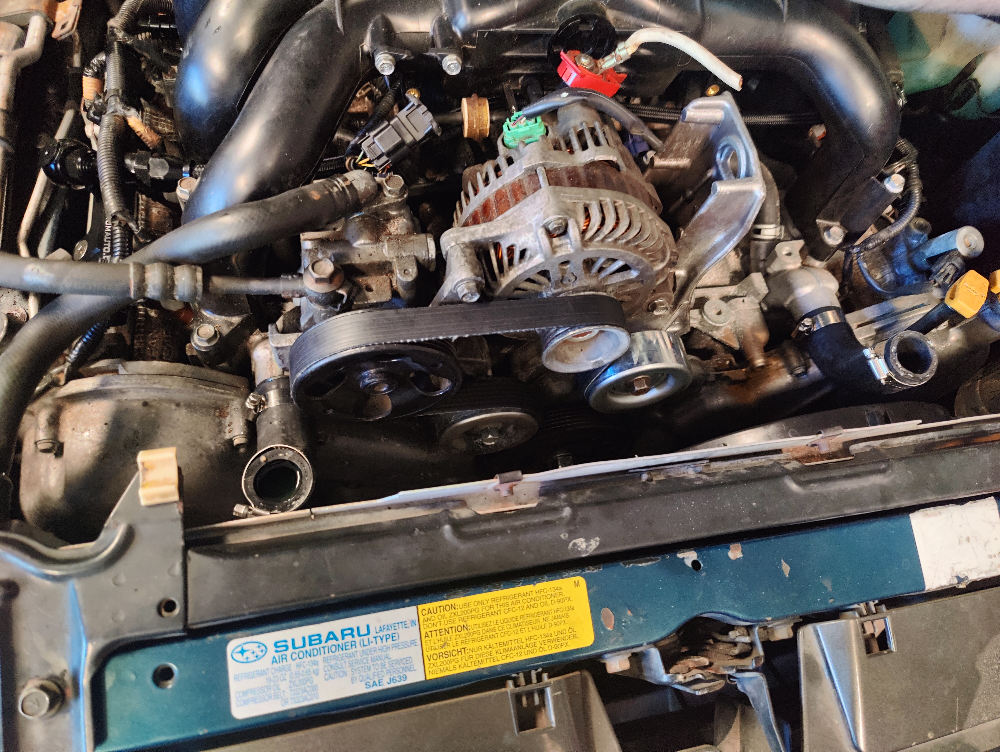

# Supercharged EZ30R Legacy Swap
A wee EZ30R Legacy swap (the newer one with the plastic intake manifold). Modest power goal between 400hp-600hp, likely with a supercharger. 

<iframe width="560" height="315" src="https://www.youtube.com/embed/Y6_W0FZ5e4A?si=H63V7x4y8nUkhAxZ" title="YouTube video player" frameborder="0" allow="accelerometer; autoplay; clipboard-write; encrypted-media; gyroscope; picture-in-picture; web-share" allowfullscreen></iframe>

<iframe width="560" height="315" src="https://www.youtube.com/embed/videoseries?si=BOyzLuO6YZmxFS-2&amp;list=PLFQKxsMzgSbhx8MJiBwqooqNe-DAWtTXl" title="YouTube video player" frameborder="0" allow="accelerometer; autoplay; clipboard-write; encrypted-media; gyroscope; picture-in-picture; web-share" allowfullscreen></iframe>

## Engine Source
I just searched for EZ30Rs on ebay. Pro tip: don't order through ebay. Call the importer directly and order, you'll get a better price because then they don't have to pay ebay fees. They usually have their phone numbers somewhere in the listing or photos.

## Forged Internals
Sourcing forged internals for this engine has proven to be a bit problematic. Below are my notes.

### Pistons
Most commonly available (and cheapest, ~$200) pistons are Supertech, but don't seem to be in stock anywhere.

*NOTE: Many **resellers** claim that they have them in stock on their site, when they don't. There are many predatory resellers out there. Always call and verify stock. Always check reviews of the site. Always use some sort of buyer protection (PayPal, credit card, etc).*

I called Connor at MAPerfornace and they don't know much about the EZ30s. They weren't even aware they were selling the pistons [on their site](https://www.maperformance.com/products/supertech-subaru-ez30r-89-20mm-bore-18cc-dish-8-5-1-cr-pistons-set-of-6-use-w-swf20070-0-p6-su8920-n18-h13). Once I pointed this out, they reached out to Supertech who stated that not only do they not have any in stock, they're not even making rings for them any more. That, along with the low price, indicates to me that they're discontinued and Supertech is just dumping stock.

According to the fella in [this video](https://www.youtube.com/watch?v=Dv1laGYsxtE), they were able to order custom pistons from JE. So maybe JE still has the blueprints for them and could make them again, but that'll take some time.

I contacted Outfront regarding the pistons (and also the rods, see below) and they only have CP pistons in stock, for $1500. Oof.

Jeremy at Outfront states that any build that goes north of 500hp should go closed-deck due to the thin cylinder walls. He also states that the stock internals are known to hold around 400hp, so the only reason to go forged internals is for very high power builds that would also need the closed-deck modification.

### Rods
[Pauter makes a set](https://pauter.com/shop/rods/subaru/subaru-3-0l-ez30-h6-rods/) which are crazy expensive (~$2000), but are rated for a ton of power. I just don't need that, so it'd be a waste.

[K1 makes some rods](https://k1technologies.com/-039dd17132), and Outfront has some in stock. I wasn't able to find them in stock anywhere else, but I didn't look very hard.

[There's some for sale on Aliexpress](https://www.aliexpress.us/item/2251801636123391.html) that are suspiciously similar to K1s. They may be the same thing. The description states to message before ordering to verify availability, so they're likely not in stock.

### Headers
I am considering making my own headers. [Raptor sells a set](https://raptorsc.com.au/subaru/subaru-libertylegacy-4-gen-ez30-header/), however they don't have an option to buy online. This leads me to believe they're not stocked (probably made-to-order) and would take a substantial amount of time to actually get. This was later verified by a follower (ty *breamis*) who had reached out to them for a set, stating they'd take ~1 month to *maybe* get a set.

In [this video](https://www.youtube.com/watch?v=Q8vW6qYIfWk) they show how they made a custom uppipe and downpipe. 

[The Skid Factory video](https://www.youtube.com/watch?v=UhJgvKnuIZg) shows how they did their headers, and I did something similar in my build just using some parts/tube I got off ebay.

### Power Steering
I got lucky on the power steering I think. I used the PS pump that came with the EZ30R, but switched out the original 99 Legacy PS lines with ones from a 2005 Subaru Impreza 2.5 RS. I have that car just sitting out back as a parts car, so that's just what I had on hand. The important thing is that the 05 RS has a "remote" resivoir that sits near the ABS pump. I was able to essentially pop the lines/resivoir off the 05 RS and pop them right into the 99 Legacy. The fittings are the same for the steering rack, and the lines connected right up to the PS pump.

### Accessory belt
Right now, this car doesn't have an AC compressor, so I've only go the power steering pump and alternator to worry about. I measured it out and a `103cm` diameter. I ended up getting a 103.4mm outer circumfrance belt, which means inner circumfrance was a bit smaller, which is perfect as we want it to be a bit taught so the tensioner has a fair bit of resistance to it. The belt I actually purchased was a `MasterPro K060400`.

[{width=400px}](./accessories.jpg)

### Links
- [Skid Factory video](https://www.youtube.com/watch?v=UhJgvKnuIZg) that has a metric fuckton of info, but you'll have to translate from Australian.
- [Possum Bourne Motorsport video](https://www.youtube.com/watch?v=Dv1laGYsxtE), who made the block for a Mighty Car Mods car.
- [OkiSubies](https://www.youtube.com/watch?v=Q8vW6qYIfWk) who has a turbo Legacy, which they give some details on. 