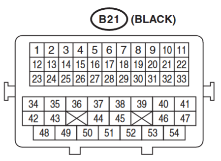
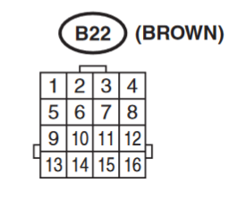
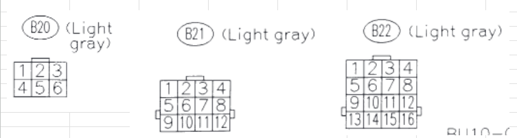

# Wiring
Below are the pinouts and pin mappings/reuse I did for the supercharged Legacy. 

### B21 Bulkhead Connector

| Pin Number | Color | Function               |
| ---------- | ----- | ---------------------- |
| 1          |       |                        |
| 2          |       |                        |
| 3          |       |                        |
| 4          |       |                        |
| 5          |       |                        |
| 6          | B     | Cam Pos Signal Ground  |
| 7          | YW    | MAP Signal             |
| 8          | BrW   | CTS                    |
| 9          | PB    | Power Steering SW      |
| 10         |       |                        |
| 11         |       |                        |
| 12         |       |                        |
| 13         | RY    | Coil 1                 |
| 14         | YG    | Coil 2                 |
| 15         | GW    | Coil 3                 |
| 16         | WL    | Coil 4                 |
| 17         | BL    | Coil 5                 |
| 18         | BY    | Coil 6                 |
| 19         | YG    | Signal Ground          |
| 20         | LY    | 5v                     |
| 21         | BL    | EGR1 (not present)     |
| 22         | YG    | EGR6 (not present)     |
| 23         | L     | AVCS RH 1              |
| 24         | R     | AVCS RH 2              |
| 25         | L     | AVLS RH 1 SW           |
| 26         | LOr   | AVLS RH 2 SW           |
| 27         | GY    | AVCS LH 1              |
| 28         | RY    | AVCS LH 2              |
| 29         | R     | AVLS LH 1 SW           |
| 30         | RW    | AVLS LH 2 SW           |
| 31         | GOr   | Oil Pressure SW        |
| 32         | BOr   | EGR3 (not pesent)      |
| 33         | YR    | EGR4 (not present)     |
| 34         | BP    | ECU Ground             |
| 35         | BW    | ECU Ground             |
| 36         | BL    | ECU Ground             |
| 37         | LR    | ECU Ground             |
| 38         | GY    | Throttle Motor 1       |
| 39         | WB    | Throttle Motor 2       |
| 40         |       |                        |
| 41         | RG    | Purge Solenoid         |
| 42         | P     | Inj 1                  |
| 43         | PL    | Inj 2                  |
| 44         | PB    | Inj 3                  |
| 45         | PG    | Inj 4                  |
| 46         | V     | Inj 5                  |
| 47         | VW    | Inj 6                  |
| 48         | YL    | 12v (Sensor, Inj, Sol) |
| 49         | LB    | Coil 12v               |
| 50         |       |                        |
| 51         |       |                        |
| 52         | R     | ECU Ground             |
| 53         |       |                        |
| 54         | B     | Coil Ground            |

### B22 Bulkhead Connector

| Pin Number | Color | Function         |
| ---------- | ----- | ---------------- |
| 1          | GR    | Cam Pos RH Hall  |
| 2          | G     | Cam Pos LH Hall  |
| 3          | L     | Oil Temp         |
| 4          |       |                  |
| 5          |       |                  |
| 6          |       |                  |
| 7          | W     | Crank VR +       |
| 8          | B     | Crank VR -       |
| 9          | LB    | VVL Oil Pr Sw RH |
| 10         | LW    | VVL Oil Pr Sw LH |
| 11         |       |                  |
| 12         |       |                  |
| 13         | W     | Knock 1          |
| 14         | B     | Knock 2          |
| 15         | W     | TPS2             |
| 16         | Or    | TPS1             |

### Wire Mappings

Below are the mappings to the actual Legacy chassis. This shows a map between bulkhead connector pin and ECU connector pin, and what I repurposed it for.

| Name      | Haltech | Leggy ECU | Leggy Bulkhead |
| --------- | ------- | --------- | -------------- |
| CTS       | B4      | 22        | B21 5          |
| CAM1      | B2      | 7         | B20 4          |
| CAM2      | B10     | 28        | B20 5          |
| TPS1      | A16     | 96        | B22 9          |
| TPS2      | A17     | 70        | B22 10         |
| DBW1      | B25     | 16        | B22 12         |
| DBW2      | B26     | 44        | B22 11         |
| Flex Fuel | B8      | 41        | Ignitor 1 YL   |
| MAP       | A15     | 6         | B21 4          |
| IAT       | B3      | 71        | B21 1          |
| AVCS 1    | B19     | 13        | B22 8          |
| AVCS 2    | A23     | 14        | B22 6          |