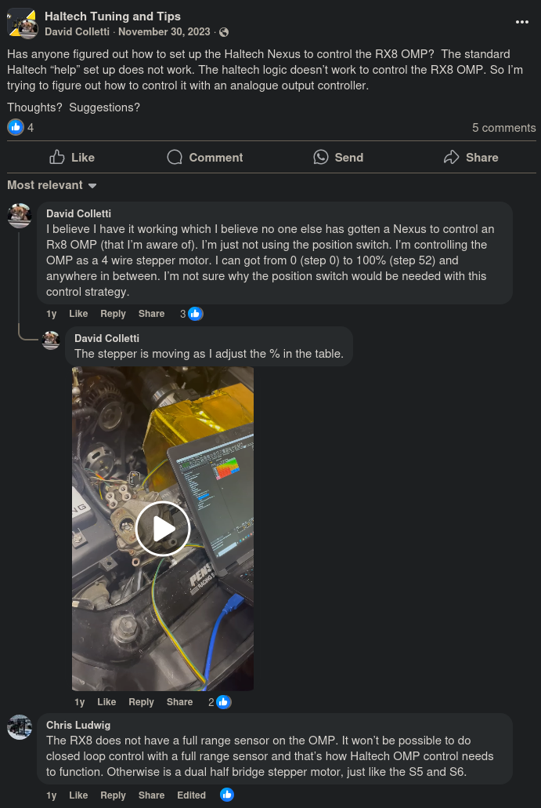
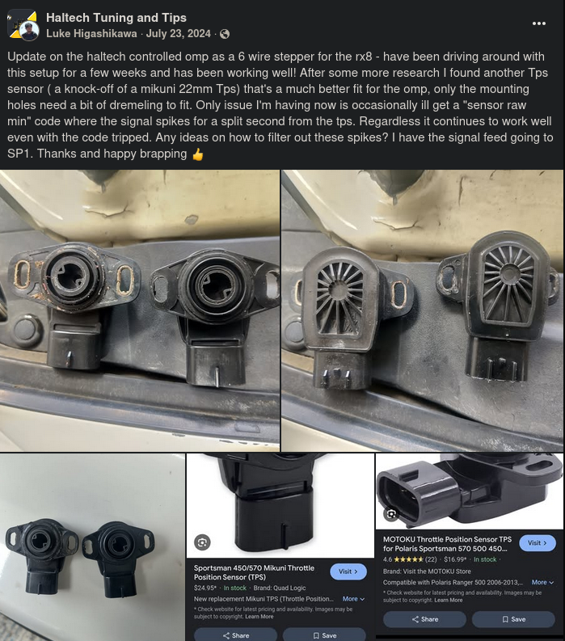

# Oil Metering Pump
There's tons of info on the RX7s OMP, but not the RX8s (shocker). 

The RX8 OMP is really a standard 4 wire stepper. The stock position sensor apparently "isn't a full range sensor". 

I was able to run the sensor in a makeshift open loop setup by creating a generic stepper output in NSP, and setting up the table accordingly. I think it has a total range of 80 steps.

You can remove the position sensor temporarily and check that the flat shaft is actually rotating when you change the values in the table.

If you want a sensor, you can use one for a "*Polaris Ranger Sportman 500 550 570*".

## Wiring
The wiring below was correct as far as pin position goes, but the colors were not. The two center pins were White/Red, and should be left disconnected. The image below was sourced from the Haltech Platinum Sport wiring guide for rotaries.

{width=400px}

## Info Sources
[This post](https://www.facebook.com/groups/haltechtuningandtips/posts/3496389273913708/) has some more info on the motor and sensor.
{width=400px}

[This other post](https://www.facebook.com/groups/haltechtuningandtips/posts/3659143074304993/) has some info on the alternative sensor for closed loop.
{width=400px}

The author of this post followed up with this info: 

> Just a heads up I ended up just running the omp in open loop as a generic 6 wire stepper in the end, the play from the tps sensor would end up giving spiked readings the whole time, causing the ECU to constantly be trying to target a varying reading from the sensor. On my current setup I'm still running the sensor but purely as a generic sensor readout so I can see the true position of the omp. No closed loop but works like a charm and I've the safety of seeing what the omp is doing.