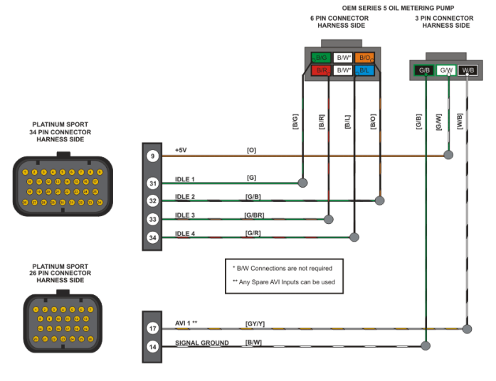

# Oil Metering Pump
There's tons of info on the RX7s OMP, but not the RX8s (shocker). 

The RX8 OMP is really a standard 4 wire stepper. The stock position sensor apparently "isn't a full range sensor". 

I was able to run the sensor in a makeshift open loop setup by creating a generic stepper output in NSP, and setting up the table accordingly. I think it has a total range of 80 steps.

You can remove the position sensor temporarily and check that the flat shaft is actually rotating when you change the values in the table.

If you want a sensor, 

## Wiring
The wiring below was correct as far as pin position goes, but the colors were not. The two center pins were White/Red, and should be left disconnected. The image below was sourced from the Haltech Platinum Sport wiring guide for rotaries.

{width=400px}

